# Overview

## The Purpose
The goal of this Ginzan Onsen tourist website is to serve as a user-friendly guide for visitors intrigued by the allure of exploring and immersing themselves in the captivating beauty and natural wonders of the Ginzan Onsen hot spring destination. Our platform is meticulously crafted to provide comprehensive insights into Ginzan Onsen's distinctive attractions, efficient transportation options, traditional Ryokan accommodations, and local culinary delights. Ultimately, our mission is to attract a diverse range of tourists to Ginzan Onsen, contributing to the local economy and ensuring that every visitor, whether a leisure traveler or an adventure enthusiast, leaves with cherished memories of their time in this enchanting destination.

## Sitemap

The website is consists of **four** sections:

* Area
  * Introduction
  * Geographic location
  * History and heritage
  * Contact Us
  * Connect With Us
* Transport
  * How to Get there?
  * By bullet train (shinkansen)
  * Rental Car
  * Taxi
* Accommodation
  * Hotel Recommendations
  * Customer Reviews
* Food Nearby
  * Food Type
  * Popular Restaurants

# The Prototype and Mockup Comparisons

## Area
### Desktop
#### Area Prototype

#### Area Mockup

#### Design Changes

While the content remained the same, there are several changes made on the entire overview of the area page. 

I received feedback from my peers regarding the readability of the titles on the image. In response, I've made enhancements to the background by incorporating gradients to achieve a darker tone. The caption has also been changed to fit in the center to improve visibility and readability. In addition, I want to enhance the colour of red on the website, the underline on the header when hovered over has been changed to red.

I received feedback from Luisa (who marked my mockup) saying that:
>Some minor inputs would be to reconsider the positioning of elements in your navigation bar, do we really need the search bar and language to be present at all times on desktop/mobile?

So I removed both the search bar and language from the Area page and only included them in Transport and Accommodation.

A logo for the website is added on the top left corner.

A new button "Visit Us to Know More" has also been added to this page.

The darker tone of the image looks more aesthetic with having a full cover background so this has been applied and the heaeder of red is removed to fit this style.

#### Area Prototype (Intro)

I included links to the three other pages "Transport, Accommodation and Foodnearby" instead of simply a photo similar to the above cover image. This provides a more comprehensive overview of the website's flow and sitemap

#### Area Prototype (Geographic Location)

While the geographic location was not initially featured in my mockup, I have now introduced three-column images highlighting the river, the perfection of Yamagata, and the enchanting onsen of Ginzan Onsen. Each location is accompanied by a pop-up caption and a red background that appears upon hovering.

#### Area Prototype (Connect With Us)

An additional "Contact Us" is incorporated for the website as well as icons to show sharing on social media.

### Mobile
#### Area Prototype
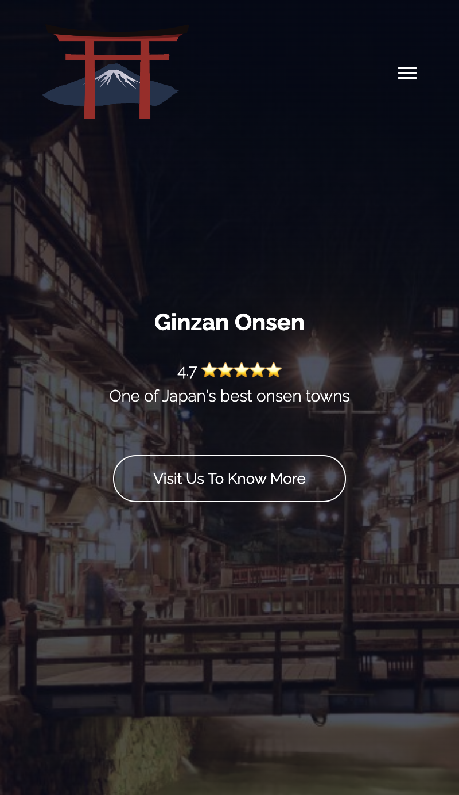
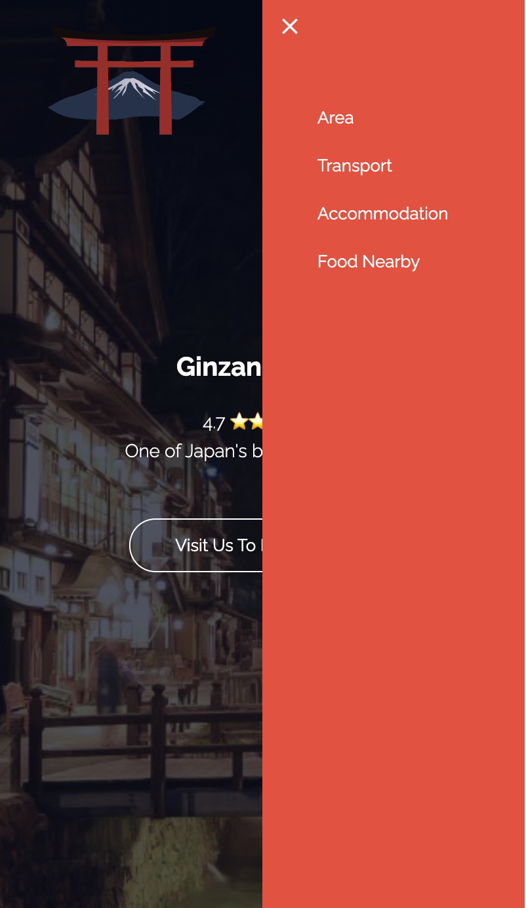
#### Area Mockup
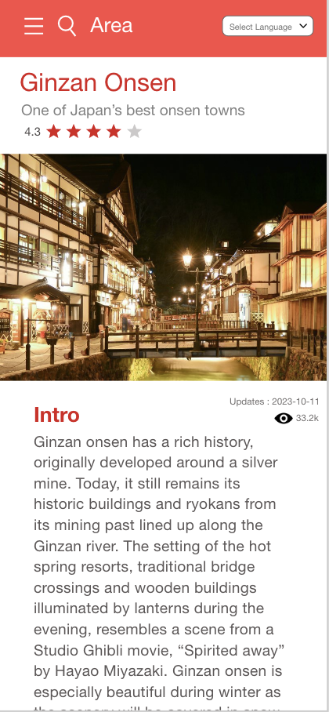
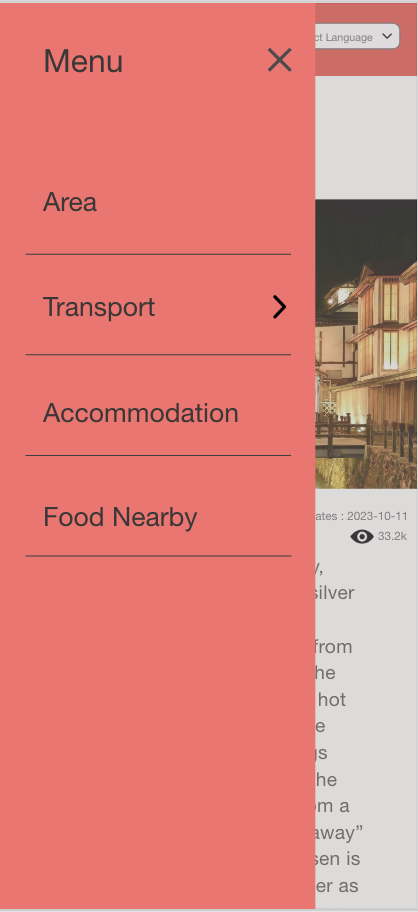

The pop-up menu has been relocated from the left to the right side, recognizing that this arrangement is more convenient for users, given that most people are right-sided. To maintain consistency and readability, the text color has been updated from black to white throughout the pop-up menu.

## Transport
### Desktop
#### Transport Prototype

#### Transport Mockup

Similar to the Area page, the header has been changed to adapt the same position to the Area page and website logo has been added.

I included additional image links on the top to link to the three modes of transport.

The rest of the elements designed stayed the same between my mockup and prototype with text on the left and image on the right and I tried to mimic my original design to the best of my ability.

### Mobile
#### Transport Prototype
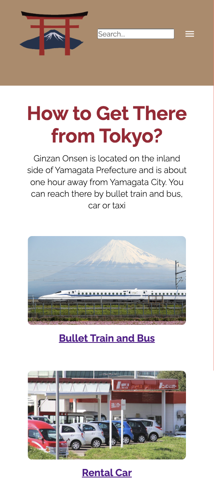
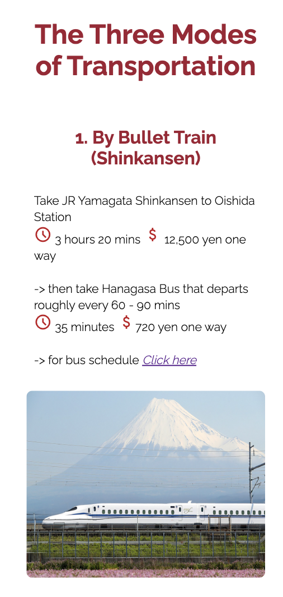
#### Transport Mockup
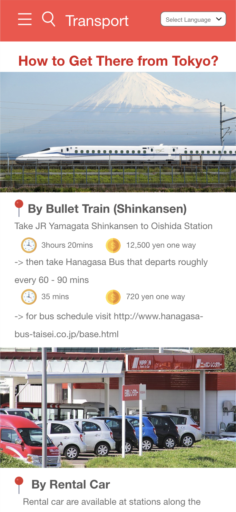

The images have been relocated beneath the text as I believed that presenting the main text first and then the image would make more sense.

I attempted to maintain the icon-then-text structure for both time and money. However, despite my efforts, they don't align perfectly. It's something to consider for next time in order to enhance the overall presentation.

## Accommodation
### Desktop
#### Accommodation Prototype

#### Accommodation Mockup

Originally, the acommodations were presented without a grid layout. The planned design was having photos on one side and accompanying details on the other. However, my peers liked the idea of having small grids layout to display the image and text similar to the presentation of food types on the 'Food Nearby' page.
The current grid format offers users a simpler and visually engaging way to browse and discover their preferred accommodations.

Additionally, a dedicated section for customer reviews has been added. This allows visitors to gain insights and perspectives from others who have experienced these accommodations firsthand, contributing to a more informed and enjoyable decision-making process for potential guests.

### Mobile
#### Accommodation Prototype
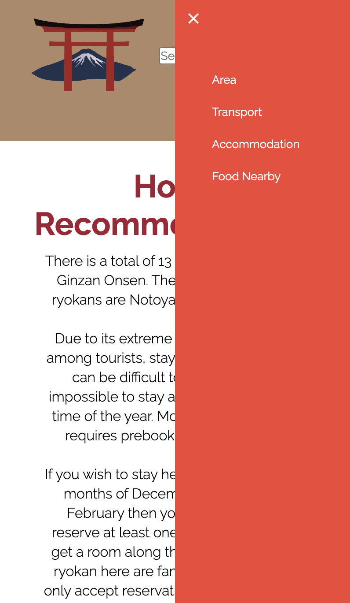
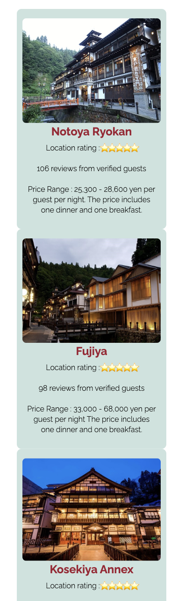
#### Accommodation Mockup
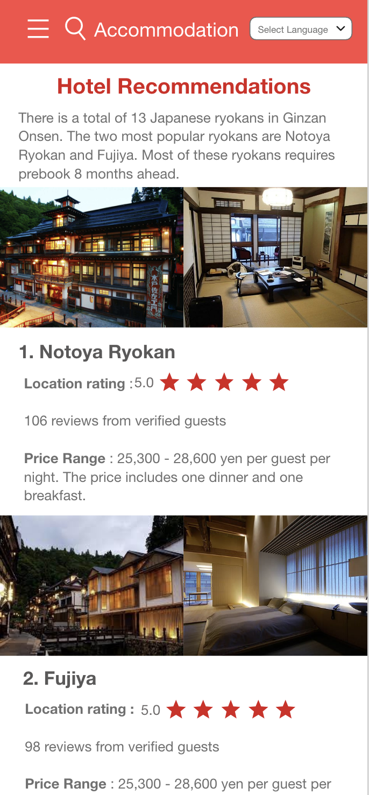

Similar to desktop the structure has been rearranged to grids presentation.

## Food Nearby
### Desktop
#### Food Nearby Prototype

#### Food Nearby Mockup

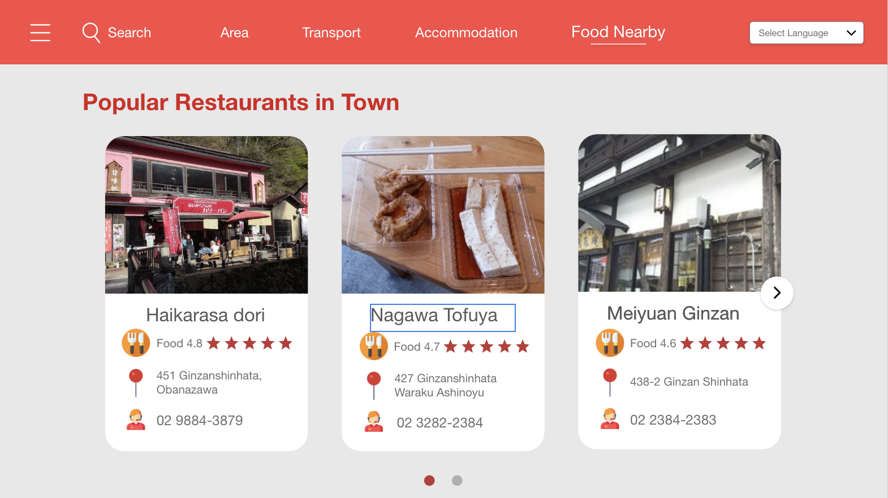

Similar to the Area page, the image background tone has been set darker for clearer visualisation of the title and text.

The Search by food type section further included the pop-up red background when being hovered over.

The 'Popular Restaurants in Town' section has been laid out as per the mockup design. However, the background color has been modified from grey to white to ensure consistency with the 'Food Type' section, creating a seamless and continuous scroll experience on the same page. With the background color now set to white, the text background has also been updated to a pink color to provide a clear and aesthetically pleasing contrast.

### Mobile
#### Food Nearby Prototype
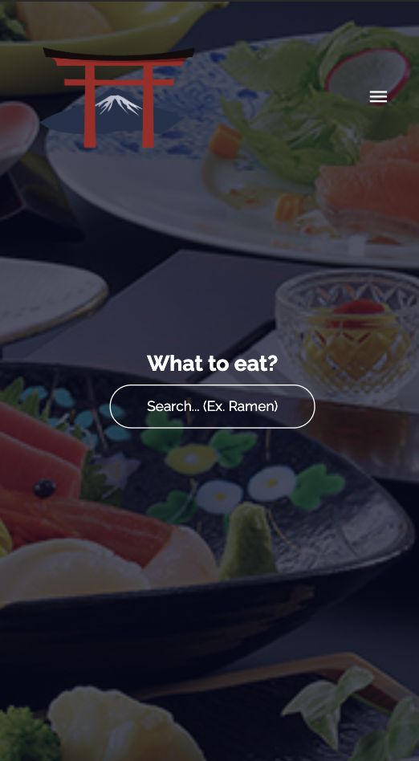
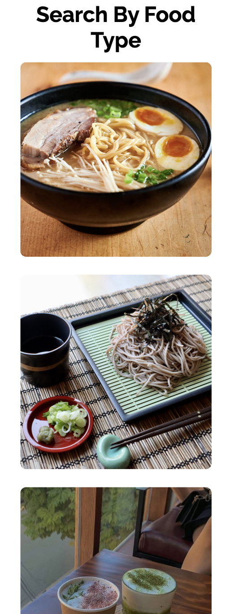
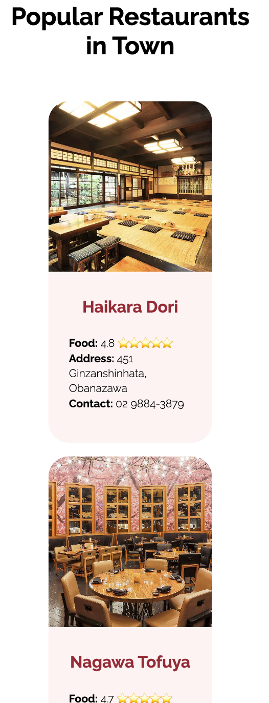
#### Food Nearby Mockup
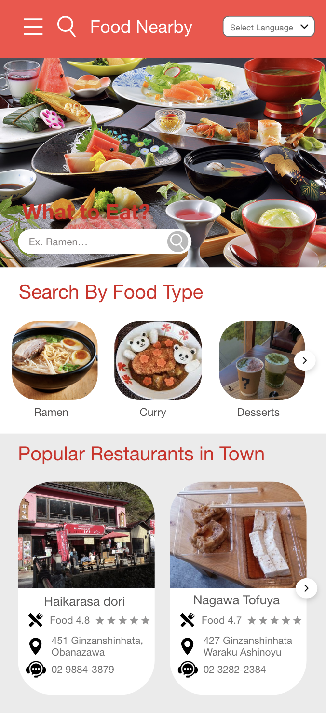

I initially wanted the food type and restaurants section to scroll horizontally. However, upon reflection, I noticed that many menus and websites adopt a vertical scrolling layout, and I thought it could work well here too.

# References

Cong. (n.d.). Japan png transparent images free download: Vector files. Pngtree. https://pngtree.com/so/japan 

Google. (n.d.-a). Material symbols and icons. Google Fonts. https://fonts.google.com/icons?selected=Material%2BSymbols%2BOutlined%3Avisibility%3AFILL%400%3Bwght%40400%3BGRAD%400%3Bopsz%4024&amp;icon.query=view 

Google. (n.d.-b). Raleway. Google Fonts. https://fonts.google.com/specimen/Raleway 

How to - search bar. How To Create a Search Bar. (n.d.). https://www.w3schools.com/howto/howto_css_searchbar.asp 

Japan Travel and living guide. Japan Travel and Living Guide. (1969, December 31). https://www.japan-guide.com/

Organization, T. T. P. (n.d.). Ginzan Onsen｜search destinations in Tohoku: Travel to Tohoku - the official tourism website of Tohoku, Japan. The official tourism website of Tohoku, Japan “TRAVEL TO TOHOKU.” https://www.tohokukanko.jp/en/attractions/detail_1265.html 

W3Schools online HTML editor. W3Schools Online Web Tutorials. (n.d.). https://www.w3schools.com/howto/tryit.asp?filename=tryhow_css_social_media_buttons 

Yamagata Bucket List: 15 best things to do in Yamagata prefecture - Japan’s Land of Snow Monsters: Live Japan Travel Guide. LIVE JAPAN. (n.d.). https://livejapan.com/en/in-tohoku/in-pref-yamagata/in-yamagata-suburbs/article-a3000001/ 

Yamashita, D. (2023a, January 30). Mt. Zao. The Hidden Japan. https://thehiddenjapan.com/mt-zao/ 

Yamashita, D. (2023b, July 18). Ginzan Onsen. The Hidden Japan. https://thehiddenjapan.com/ginzan-onsen/ 